# SkillFoundry

SkillFoundry 是一个基于 **LangGraph + ContextForge + ForgeUnit + 外部
Codex/worker 边界 + 独立 Verifier** 的 AI-native Capability Bundle 工厂实验系统。

它的长期产品宪法是：Codex 是通用 AI 工作台，Skill 是领域能力入口，
SkillFoundry 把任意需求铸造成可安装、可运行、可验证、可复用的能力包。
详见 [SkillFoundry Capability Bundle Vision](docs/SKILLFOUNDRY_CAPABILITY_BUNDLE_VISION.md)。

当前主线不是旧 WP0-WP17 原型，而是：

```text
FrontDesk
  -> ContextForge Goal Runtime
  -> ForgeUnit SkillFoundry vNext
  -> Codex exec / deterministic fake command boundary
  -> SkillFoundry Verifier
  -> Registry
```



```mermaid
flowchart LR
    %% 节点定义
    U(["🧑‍💻 业务方 / 用户<br/>模糊 Skill 需求"])
    D[["📦 最终交付物<br/>可下载 Skill 包<br/>Final Report<br/>Refs-only Status"]]

    subgraph SF ["✨ SkillFoundry 当前闭环 ✨"]
        direction LR

        FD("🛠️ FrontDesk<br/>澄清需求 | 评审计划 | 冻结规格")
        CF("🛡️ ContextForge Boundary<br/>管理上下文视界<br/>禁止原始对话进入构建<br/>保留 refs-only 证据")
        FU("⚙️ ForgeUnit Factory<br/>下发受控构建任务<br/>记录尝试证据<br/>维持命令边界")
        W{{"🤖 External Worker<br/>Codex exec 或 deterministic fake<br/>生成候选 Skill"}}
        V("✅ Verifier<br/>独立验收<br/>质量 / 安全 / 证据")
        R[("🗄️ Local Registry<br/>只注册 verifier-passed<br/>Skill 资产")]

        SPEC["📄 冻结规格 (SkillSpec)<br/>Acceptance Criteria<br/>Verification Spec"]
        RULES["📜 证据规则<br/>raw conversation/prompt/transcript<br/>不进入构建状态或公开摘要"]
    end

    %% 主流程 (恢复标准箭头，保持排版紧凑)
    U -->|输入需求| FD
    FD -->|初始化| CF
    CF -->|传递受控上下文| FU
    FU -->|分派任务| W
    W -->|提交候选| V
    V -->|通过验收| R
    R -->|打包导出| D

    %% 回退流
    V -.->|❌ 未通过：回到构建层修复| FU

    %% 数据与约束流 (调整连线逻辑，避免引擎画大弧线)
    FD -.->|产出| SPEC
    SPEC -.->|约束| CF
    CF -.->|输出| RULES
    RULES -.->|校验基准| V

    %% 样式定义
    classDef user fill:#dbeafe,stroke:#2563eb,stroke-width:2px,color:#0f172a;
    classDef frontdesk fill:#cffafe,stroke:#0891b2,stroke-width:2px,color:#0f172a;
    classDef context fill:#ede9fe,stroke:#7c3aed,stroke-width:2px,color:#0f172a;
    classDef factory fill:#ffedd5,stroke:#f97316,stroke-width:2px,color:#0f172a;
    classDef worker fill:#f1f5f9,stroke:#475569,stroke-width:2px,color:#0f172a;
    classDef verify fill:#fee2e2,stroke:#dc2626,stroke-width:2px,color:#0f172a;
    classDef registry fill:#dcfce7,stroke:#16a34a,stroke-width:2px,color:#0f172a;
    classDef artifact fill:#ffffff,stroke:#94a3b8,stroke-width:2px,stroke-dasharray: 5 5,color:#0f172a;

    class U user;
    class FD frontdesk;
    class CF context;
    class FU factory;
    class W worker;
    class V verify;
    class R registry;
    class D,SPEC,RULES artifact;

    %% 关键修复：子图背景改为 fill:none，完美适配深色/浅色模式
    style SF fill:none,stroke:#64748b,stroke-width:2px,stroke-dasharray: 5 5,rx:10,ry:10
```

## Current Mainline

- **ContextForge**：agent 工作外骨骼，负责上下文视界、边界证据、cache plan、
  checkpoint 和 ledger。
- **ForgeUnit**：LangGraph 内的 work-unit harness，负责把强 worker 放进可审计、
  可验证的执行边界。
- **FrontDesk**：把用户模糊需求转为 core need、solution plan、frozen
  SkillSpec 和 acceptance criteria。
- **Codex exec / external worker**：可选执行体。默认测试不调用 live Codex。
- **Verifier / Registry**：独立质量门和资产注册门。worker self-report 不是验收。

## Quick Start

```bash
git clone --recurse-submodules git@github.com:manstein-lzn/skillfoundry.git
cd skillfoundry
git submodule update --init --recursive

python3 -m venv .venv
.venv/bin/python -m pip install --upgrade pip
.venv/bin/python -m pip install -e third_party/contextforge
.venv/bin/python -m pip install -e ".[test,forgeunit]"
```

ForgeUnit is installed from the pinned Git tag:

```text
git+ssh://git@github.com/manstein-lzn/forgeunit.git@v1.2.1
```

It is not resolved from a local sibling directory.

## Developer Commands

Use the Makefile entrypoints:

```bash
make focused
make test
make fresh-clone-smoke
make live-semantic-eval-help
```

Equivalent script entrypoints:

```bash
scripts/dev_check.sh focused
scripts/dev_check.sh full
scripts/dev_check.sh fresh-clone
scripts/dev_check.sh live-help
```

Default commands are deterministic/offline. They do not call live Codex.

## Validation Gates

Use these before claiming a change is ready:

```bash
make focused
make test
```

Use this before claiming a new checkout can reproduce the baseline:

```bash
make fresh-clone-smoke
```

That command creates a temporary fresh clone, installs dependencies from public
Git refs, and runs a two-scenario fake-mode semantic smoke.

Live Codex semantic eval is manual and opt-in only:

```bash
make live-semantic-eval-help
```

Then follow [docs/FRONTDESK_LIVE_SEMANTIC_EVAL.md](docs/FRONTDESK_LIVE_SEMANTIC_EVAL.md).

## Important Docs

Start from [docs/README.md](docs/README.md) and
[docs/SYSTEM_MAP.md](docs/SYSTEM_MAP.md).

Current mainline docs:

- [SkillFoundry Capability Bundle Vision](docs/SKILLFOUNDRY_CAPABILITY_BUNDLE_VISION.md)
- [System Map](docs/SYSTEM_MAP.md)
- [Development Workflow](docs/DEVELOPMENT_WORKFLOW.md)
- [Fresh Clone Gate](docs/FRESH_CLONE_GATE.md)
- [Legacy Compatibility](docs/LEGACY_COMPATIBILITY.md)
- [Test Ownership](tests/README.md)
- [FrontDesk Live Semantic Eval](docs/FRONTDESK_LIVE_SEMANTIC_EVAL.md)
- [Product Validation PV001: Codexarium Clean-Room Rebuild](docs/PRODUCT_VALIDATION_CODEXARIUM_REBUILD_PLAN.md)
- [SkillFoundry v2 Baseline](docs/SKILLFOUNDRY_V2_BASELINE.md)
- [SkillFoundry ContextForge Refactor Plan](docs/SKILLFOUNDRY_CONTEXTFORGE_REFACTOR_PLAN.md)
- [ForgeUnit SkillFoundry Composition](docs/FORGEUNIT_SKILLFOUNDRY_COMPOSITION.md)
- [ContextForge Agent Exoskeleton Product Vision](docs/CONTEXTFORGE_AGENT_EXOSKELETON_PRODUCT_VISION.md)

Historical WP/v0 roadmaps, pilots, and operations notes are preserved under
[docs/archive](docs/archive/). They are context, not the current implementation
contract.

## Repository Layout

```text
src/forgeunit_skillfoundry/   # current clean composition layer
src/skillfoundry/             # product capabilities reused by the current layer
tests/                        # deterministic/offline tests
scripts/                      # local gates and explicit manual pilots
third_party/contextforge/     # ContextForge submodule
docs/                         # current docs plus archive
```

## Boundaries

SkillFoundry currently proves a governed Codex Skill factory path. It is not yet
presented as a production multi-tenant platform.

Short-term repository cleanup is complete through Phase 13N. See
[docs/SKILLFOUNDRY_CLEANUP_COMPLETION_PLAN.md](docs/SKILLFOUNDRY_CLEANUP_COMPLETION_PLAN.md).
Real product validation with live Codex scenarios is intentionally later.

Not default:

- live Codex calls;
- background workers or schedulers;
- long-term memory daemons;
- CI deployment;
- production auth/tenant/queue/audit stack.

Those may be added later, but the current baseline is intentionally small,
auditable, and deterministic by default.
